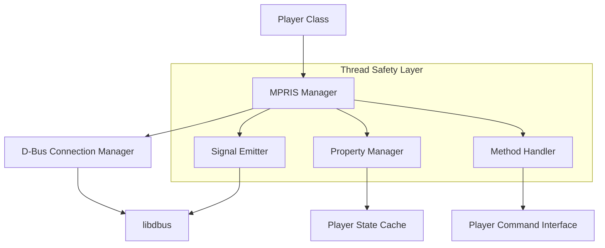

# Design Document

## Overview

The MPRIS refactoring will transform the current monolithic, error-prone implementation into a robust, thread-safe, and maintainable system. The new design follows the established threading safety patterns in PsyMP3, implements comprehensive error handling, and provides a clean separation of concerns between D-Bus communication and Player state management.

The refactored MPRIS system will consist of multiple cooperating classes that handle different aspects of the MPRIS protocol, each following the public/private lock pattern and RAII resource management principles established in the project's threading safety guidelines.

## Architecture

### High-Level Architecture



### Component Responsibilities

1. **MPRIS Manager**: Central coordinator implementing the public/private lock pattern
2. **D-Bus Connection Manager**: Handles connection lifecycle with automatic reconnection
3. **Property Manager**: Manages MPRIS property state with thread-safe caching
4. **Method Handler**: Processes incoming D-Bus method calls safely
5. **Signal Emitter**: Sends property change signals without blocking

## Components and Interfaces

### 1. MPRIS Manager Class

The main interface that replaces the current monolithic MPRIS class:

```cpp
class MPRISManager {
public:
    // Public API - follows threading safety pattern
    MPRISManager(Player* player);
    ~MPRISManager();
    
    bool initialize();
    void shutdown();
    void updateMetadata(const std::string& artist, const std::string& title, const std::string& album);
    void updatePlaybackStatus(PlaybackStatus status);
    void updatePosition(uint64_t position_us);
    bool isInitialized() const;
    
private:
    // Private implementations - assume locks held
    bool initialize_unlocked();
    void shutdown_unlocked();
    void updateMetadata_unlocked(const std::string& artist, const std::string& title, const std::string& album);
    void updatePlaybackStatus_unlocked(PlaybackStatus status);
    void updatePosition_unlocked(uint64_t position_us);
    bool isInitialized_unlocked() const;
    
    // Internal state management
    void handleConnectionLoss_unlocked();
    void scheduleReconnection_unlocked();
    
    mutable std::mutex m_mutex;
    Player* m_player;
    std::unique_ptr<DBusConnectionManager> m_connection;
    std::unique_ptr<PropertyManager> m_properties;
    std::unique_ptr<MethodHandler> m_methods;
    std::unique_ptr<SignalEmitter> m_signals;
    bool m_initialized;
    std::atomic<bool> m_shutdown_requested;
};
```###
 2. D-Bus Connection Manager

Handles D-Bus connection lifecycle with automatic error recovery:

```cpp
class DBusConnectionManager {
public:
    DBusConnectionManager();
    ~DBusConnectionManager();
    
    bool connect();
    void disconnect();
    bool isConnected() const;
    DBusConnection* getConnection();
    
    // Automatic reconnection support
    void enableAutoReconnect(bool enable);
    bool attemptReconnection();
    
private:
    bool connect_unlocked();
    void disconnect_unlocked();
    bool isConnected_unlocked() const;
    void cleanupConnection_unlocked();
    
    mutable std::mutex m_mutex;
    std::unique_ptr<DBusConnection, DBusConnectionDeleter> m_connection;
    bool m_auto_reconnect;
    std::chrono::steady_clock::time_point m_last_reconnect_attempt;
    static constexpr std::chrono::seconds RECONNECT_INTERVAL{5};
};
```

### 3. Property Manager

Thread-safe caching and management of MPRIS properties:

```cpp
class PropertyManager {
public:
    PropertyManager(Player* player);
    
    void updateMetadata(const std::string& artist, const std::string& title, const std::string& album);
    void updatePlaybackStatus(PlaybackStatus status);
    void updatePosition(uint64_t position_us);
    
    // Property getters for D-Bus responses
    std::string getPlaybackStatus() const;
    std::map<std::string, DBusVariant> getMetadata() const;
    uint64_t getPosition() const;
    
private:
    void updateMetadata_unlocked(const std::string& artist, const std::string& title, const std::string& album);
    void updatePlaybackStatus_unlocked(PlaybackStatus status);
    void updatePosition_unlocked(uint64_t position_us);
    
    std::string getPlaybackStatus_unlocked() const;
    std::map<std::string, DBusVariant> getMetadata_unlocked() const;
    uint64_t getPosition_unlocked() const;
    
    mutable std::mutex m_mutex;
    Player* m_player;
    
    // Cached property state
    std::string m_artist;
    std::string m_title;
    std::string m_album;
    PlaybackStatus m_status;
    uint64_t m_position_us;
    std::chrono::steady_clock::time_point m_position_timestamp;
};
```

### 4. Method Handler

Processes incoming D-Bus method calls with proper error handling:

```cpp
class MethodHandler {
public:
    MethodHandler(Player* player, PropertyManager* properties);
    
    DBusHandlerResult handleMessage(DBusConnection* connection, DBusMessage* message);
    
private:
    DBusHandlerResult handleMessage_unlocked(DBusConnection* connection, DBusMessage* message);
    
    // Individual method handlers
    DBusHandlerResult handlePlay_unlocked(DBusConnection* connection, DBusMessage* message);
    DBusHandlerResult handlePause_unlocked(DBusConnection* connection, DBusMessage* message);
    DBusHandlerResult handleStop_unlocked(DBusConnection* connection, DBusMessage* message);
    DBusHandlerResult handleNext_unlocked(DBusConnection* connection, DBusMessage* message);
    DBusHandlerResult handlePrevious_unlocked(DBusConnection* connection, DBusMessage* message);
    DBusHandlerResult handleSeek_unlocked(DBusConnection* connection, DBusMessage* message);
    DBusHandlerResult handleSetPosition_unlocked(DBusConnection* connection, DBusMessage* message);
    DBusHandlerResult handleGetProperty_unlocked(DBusConnection* connection, DBusMessage* message);
    DBusHandlerResult handleSetProperty_unlocked(DBusConnection* connection, DBusMessage* message);
    
    // Utility methods
    void sendMethodReturn_unlocked(DBusConnection* connection, DBusMessage* message);
    void sendErrorReply_unlocked(DBusConnection* connection, DBusMessage* message, const std::string& error_name, const std::string& error_message);
    
    mutable std::mutex m_mutex;
    Player* m_player;
    PropertyManager* m_properties;
};
```

### 5. Signal Emitter

Sends MPRIS property change signals asynchronously:

```cpp
class SignalEmitter {
public:
    SignalEmitter(DBusConnectionManager* connection);
    ~SignalEmitter();
    
    void emitPropertiesChanged(const std::string& interface, const std::map<std::string, DBusVariant>& changed_properties);
    void emitSeeked(uint64_t position_us);
    
private:
    void emitPropertiesChanged_unlocked(const std::string& interface, const std::map<std::string, DBusVariant>& changed_properties);
    void emitSeeked_unlocked(uint64_t position_us);
    
    void signalWorkerLoop();
    void processSignalQueue_unlocked();
    
    mutable std::mutex m_mutex;
    DBusConnectionManager* m_connection;
    
    // Asynchronous signal emission
    std::thread m_signal_thread;
    std::atomic<bool> m_signal_thread_active;
    std::queue<std::function<void()>> m_signal_queue;
    std::condition_variable m_signal_cv;
};
```## Data 
Models

### Enumerations and Types

```cpp
enum class PlaybackStatus {
    Playing,
    Paused,
    Stopped
};

enum class LoopStatus {
    None,
    Track,
    Playlist
};

struct DBusVariant {
    enum Type { String, StringArray, Int64, UInt64, Double, Boolean } type;
    std::variant<std::string, std::vector<std::string>, int64_t, uint64_t, double, bool> value;
};

struct MPRISMetadata {
    std::string artist;
    std::string title;
    std::string album;
    std::string track_id;
    uint64_t length_us;
    std::string art_url;
    
    std::map<std::string, DBusVariant> toDBusDict() const;
};
```

### RAII Resource Management

```cpp
// Custom deleters for D-Bus resources
struct DBusConnectionDeleter {
    void operator()(DBusConnection* conn) {
        if (conn) {
            dbus_connection_unref(conn);
        }
    }
};

struct DBusMessageDeleter {
    void operator()(DBusMessage* msg) {
        if (msg) {
            dbus_message_unref(msg);
        }
    }
};

// RAII wrappers
using DBusConnectionPtr = std::unique_ptr<DBusConnection, DBusConnectionDeleter>;
using DBusMessagePtr = std::unique_ptr<DBusMessage, DBusMessageDeleter>;
```

## Error Handling

### Error Categories

1. **D-Bus Connection Errors**: Network issues, service unavailability
2. **Message Processing Errors**: Malformed messages, invalid parameters
3. **Player State Errors**: Invalid state transitions, resource conflicts
4. **Threading Errors**: Deadlocks, race conditions

### Error Handling Strategy

```cpp
class MPRISError : public std::exception {
public:
    enum class Category {
        Connection,
        Message,
        PlayerState,
        Threading
    };
    
    MPRISError(Category category, const std::string& message);
    const char* what() const noexcept override;
    Category getCategory() const { return m_category; }
    
private:
    Category m_category;
    std::string m_message;
};

// Error handling pattern
template<typename T>
class Result {
public:
    static Result success(T value) { return Result(std::move(value)); }
    static Result error(const std::string& message) { return Result(message); }
    
    bool isSuccess() const { return m_success; }
    const T& getValue() const { return m_value; }
    const std::string& getError() const { return m_error; }
    
private:
    Result(T value) : m_success(true), m_value(std::move(value)) {}
    Result(const std::string& error) : m_success(false), m_error(error) {}
    
    bool m_success;
    T m_value;
    std::string m_error;
};
```

## Testing Strategy

### Unit Testing Approach

1. **Mock D-Bus Interface**: Create mock D-Bus connection for isolated testing
2. **Threading Safety Tests**: Verify public/private lock pattern compliance
3. **Error Injection Tests**: Test error handling and recovery scenarios
4. **Property Synchronization Tests**: Verify state consistency between Player and MPRIS

### Test Structure

```cpp
class MockDBusConnection {
public:
    MOCK_METHOD(bool, connect, ());
    MOCK_METHOD(void, disconnect, ());
    MOCK_METHOD(bool, sendMessage, (DBusMessage* message));
    MOCK_METHOD(void, setMessageHandler, (std::function<DBusHandlerResult(DBusMessage*)> handler));
};

class MPRISManagerTest : public ::testing::Test {
protected:
    void SetUp() override;
    void TearDown() override;
    
    std::unique_ptr<MockPlayer> m_mock_player;
    std::unique_ptr<MockDBusConnection> m_mock_dbus;
    std::unique_ptr<MPRISManager> m_mpris_manager;
};
```

### Integration Testing

1. **Real D-Bus Testing**: Test against actual D-Bus daemon
2. **Player Integration**: Test with real Player instance
3. **Stress Testing**: High-concurrency scenarios
4. **Reconnection Testing**: Network failure simulation

## Performance Considerations

### Optimization Strategies

1. **Lazy Property Updates**: Only emit signals when properties actually change
2. **Batched Signal Emission**: Combine multiple property changes into single signal
3. **Lock Granularity**: Minimize lock hold times with fine-grained locking
4. **Asynchronous Operations**: Non-blocking signal emission and reconnection

### Memory Management

1. **RAII Throughout**: All D-Bus resources managed with smart pointers
2. **String Optimization**: Use string views where possible to avoid copies
3. **Property Caching**: Cache frequently accessed properties to avoid Player queries
4. **Queue Limits**: Bounded queues to prevent memory growth under load