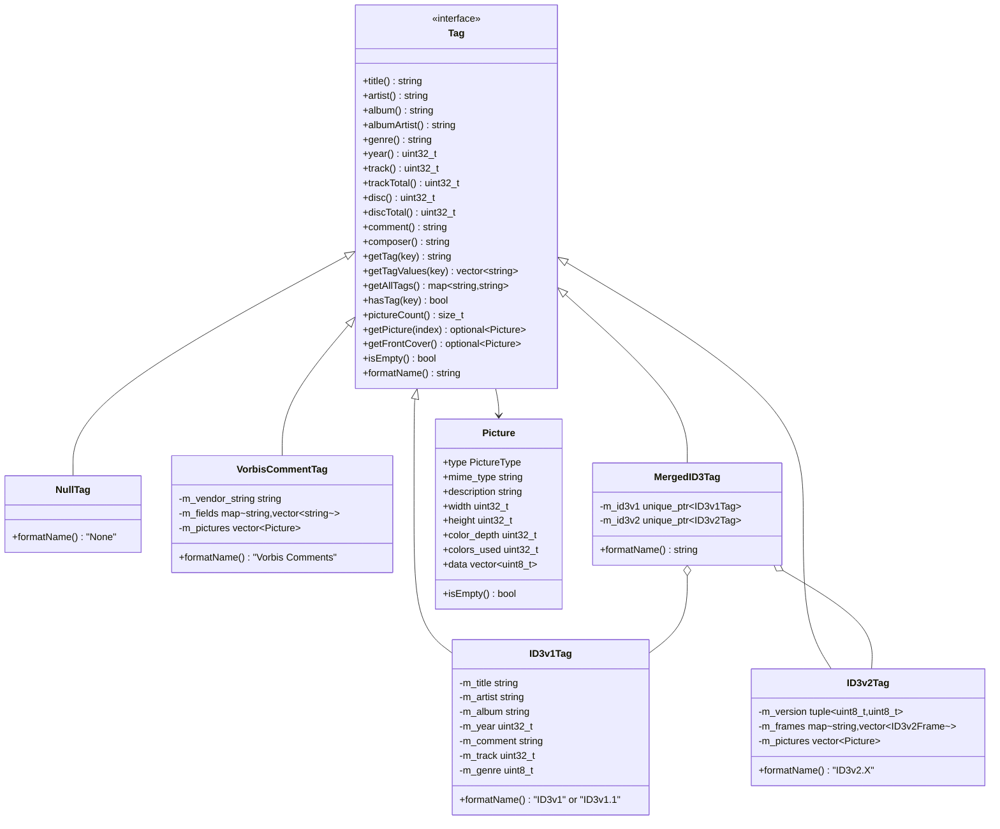
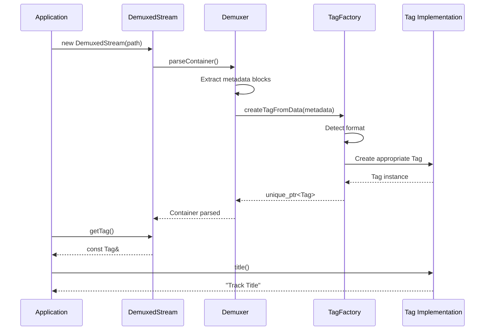

# Design Document: Tag Framework

## Overview

The Tag framework provides a unified, format-neutral interface for reading metadata tags from audio files. It supports multiple tag formats (VorbisComment, ID3v1, ID3v2) and integrates seamlessly with PsyMP3's Stream and DemuxedStream classes. The design follows the existing architectural patterns in PsyMP3, using abstract interfaces, factory patterns, and the established namespace conventions.

The framework is designed for read-only access to metadata, with thread-safe concurrent reads and robust error handling for corrupted or malformed tag data.

## Architecture



### Component Interaction



## Components and Interfaces

### Tag Interface (Existing - Enhanced)

The existing `PsyMP3::Tag::Tag` interface is already well-designed. We will implement concrete classes for each tag format.

```cpp
namespace PsyMP3 {
namespace Tag {

// Already defined in include/tag/Tag.h
class Tag {
public:
    virtual ~Tag() = default;
    
    // Core metadata
    virtual std::string title() const = 0;
    virtual std::string artist() const = 0;
    virtual std::string album() const = 0;
    virtual std::string albumArtist() const = 0;
    virtual std::string genre() const = 0;
    virtual uint32_t year() const = 0;
    virtual uint32_t track() const = 0;
    virtual uint32_t trackTotal() const = 0;
    virtual uint32_t disc() const = 0;
    virtual uint32_t discTotal() const = 0;
    virtual std::string comment() const = 0;
    virtual std::string composer() const = 0;
    
    // Extended access
    virtual std::string getTag(const std::string& key) const = 0;
    virtual std::vector<std::string> getTagValues(const std::string& key) const = 0;
    virtual std::map<std::string, std::string> getAllTags() const = 0;
    virtual bool hasTag(const std::string& key) const = 0;
    
    // Pictures
    virtual size_t pictureCount() const = 0;
    virtual std::optional<Picture> getPicture(size_t index) const = 0;
    virtual std::optional<Picture> getFrontCover() const = 0;
    
    // State
    virtual bool isEmpty() const = 0;
    virtual std::string formatName() const = 0;
};

} // namespace Tag
} // namespace PsyMP3
```

### VorbisCommentTag

Implements the Tag interface for VorbisComment metadata found in Ogg and FLAC containers.

```cpp
namespace PsyMP3 {
namespace Tag {

class VorbisCommentTag : public Tag {
public:
    // Construction from raw VorbisComment data
    static std::unique_ptr<VorbisCommentTag> parse(const uint8_t* data, size_t size);
    
    // Construction from pre-parsed fields
    VorbisCommentTag(const std::string& vendor,
                     const std::map<std::string, std::vector<std::string>>& fields);
    
    // Tag interface implementation
    std::string title() const override;
    std::string artist() const override;
    std::string album() const override;
    std::string albumArtist() const override;
    std::string genre() const override;
    uint32_t year() const override;
    uint32_t track() const override;
    uint32_t trackTotal() const override;
    uint32_t disc() const override;
    uint32_t discTotal() const override;
    std::string comment() const override;
    std::string composer() const override;
    
    std::string getTag(const std::string& key) const override;
    std::vector<std::string> getTagValues(const std::string& key) const override;
    std::map<std::string, std::string> getAllTags() const override;
    bool hasTag(const std::string& key) const override;
    
    size_t pictureCount() const override;
    std::optional<Picture> getPicture(size_t index) const override;
    std::optional<Picture> getFrontCover() const override;
    
    bool isEmpty() const override;
    std::string formatName() const override { return "Vorbis Comments"; }
    
    // VorbisComment-specific
    std::string vendorString() const { return m_vendor_string; }
    
private:
    std::string m_vendor_string;
    std::map<std::string, std::vector<std::string>> m_fields; // Case-normalized keys
    std::vector<Picture> m_pictures;
    
    // Helper to normalize field names to uppercase
    static std::string normalizeFieldName(const std::string& name);
    
    // Helper to parse METADATA_BLOCK_PICTURE
    static std::optional<Picture> parsePictureField(const std::string& base64_data);
};

} // namespace Tag
} // namespace PsyMP3
```

### ID3v1Tag

Implements the Tag interface for ID3v1/ID3v1.1 tags.

```cpp
namespace PsyMP3 {
namespace Tag {

class ID3v1Tag : public Tag {
public:
    // Parse from 128-byte ID3v1 data
    static std::unique_ptr<ID3v1Tag> parse(const uint8_t* data);
    
    // Check if data contains valid ID3v1 tag
    static bool isValid(const uint8_t* data);
    
    // Tag interface implementation
    std::string title() const override { return m_title; }
    std::string artist() const override { return m_artist; }
    std::string album() const override { return m_album; }
    std::string albumArtist() const override { return ""; } // Not in ID3v1
    std::string genre() const override;
    uint32_t year() const override { return m_year; }
    uint32_t track() const override { return m_track; }
    uint32_t trackTotal() const override { return 0; } // Not in ID3v1
    uint32_t disc() const override { return 0; } // Not in ID3v1
    uint32_t discTotal() const override { return 0; } // Not in ID3v1
    std::string comment() const override { return m_comment; }
    std::string composer() const override { return ""; } // Not in ID3v1
    
    std::string getTag(const std::string& key) const override;
    std::vector<std::string> getTagValues(const std::string& key) const override;
    std::map<std::string, std::string> getAllTags() const override;
    bool hasTag(const std::string& key) const override;
    
    size_t pictureCount() const override { return 0; } // No pictures in ID3v1
    std::optional<Picture> getPicture(size_t) const override { return std::nullopt; }
    std::optional<Picture> getFrontCover() const override { return std::nullopt; }
    
    bool isEmpty() const override;
    std::string formatName() const override;
    
    // ID3v1-specific
    bool isID3v1_1() const { return m_is_v1_1; }
    uint8_t genreIndex() const { return m_genre_index; }
    
private:
    std::string m_title;
    std::string m_artist;
    std::string m_album;
    uint32_t m_year = 0;
    std::string m_comment;
    uint32_t m_track = 0;
    uint8_t m_genre_index = 255; // 255 = unknown
    bool m_is_v1_1 = false;
    
    // Genre lookup table
    static const std::vector<std::string>& genreList();
    
    // Helper to trim trailing nulls and spaces
    static std::string trimString(const char* data, size_t max_len);
};

} // namespace Tag
} // namespace PsyMP3
```

### ID3v2Tag

Implements the Tag interface for ID3v2 tags (versions 2.2, 2.3, 2.4).

```cpp
namespace PsyMP3 {
namespace Tag {

// ID3v2 frame structure
struct ID3v2Frame {
    std::string id;           // 4-char frame ID (3-char for v2.2)
    std::vector<uint8_t> data;
    uint16_t flags = 0;       // Frame flags (v2.3/v2.4)
};

class ID3v2Tag : public Tag {
public:
    // Parse from ID3v2 data (starting at "ID3" header)
    static std::unique_ptr<ID3v2Tag> parse(const uint8_t* data, size_t size);
    
    // Check if data starts with valid ID3v2 header
    static bool isValid(const uint8_t* data, size_t size);
    
    // Get total tag size (including header) from header bytes
    static size_t getTagSize(const uint8_t* header);
    
    // Tag interface implementation
    std::string title() const override;
    std::string artist() const override;
    std::string album() const override;
    std::string albumArtist() const override;
    std::string genre() const override;
    uint32_t year() const override;
    uint32_t track() const override;
    uint32_t trackTotal() const override;
    uint32_t disc() const override;
    uint32_t discTotal() const override;
    std::string comment() const override;
    std::string composer() const override;
    
    std::string getTag(const std::string& key) const override;
    std::vector<std::string> getTagValues(const std::string& key) const override;
    std::map<std::string, std::string> getAllTags() const override;
    bool hasTag(const std::string& key) const override;
    
    size_t pictureCount() const override;
    std::optional<Picture> getPicture(size_t index) const override;
    std::optional<Picture> getFrontCover() const override;
    
    bool isEmpty() const override;
    std::string formatName() const override;
    
    // ID3v2-specific
    uint8_t majorVersion() const { return m_major_version; }
    uint8_t minorVersion() const { return m_minor_version; }
    
private:
    uint8_t m_major_version = 0; // 2, 3, or 4
    uint8_t m_minor_version = 0;
    uint8_t m_flags = 0;
    std::map<std::string, std::vector<ID3v2Frame>> m_frames;
    std::vector<Picture> m_pictures;
    
    // Frame ID mapping (v2.2 3-char to v2.3+ 4-char)
    static std::string normalizeFrameId(const std::string& id, uint8_t version);
    
    // Text encoding handling
    static std::string decodeText(const uint8_t* data, size_t size, uint8_t encoding);
    
    // Synchsafe integer decoding
    static uint32_t decodeSynchsafe(const uint8_t* data);
    
    // Parse APIC frame
    static std::optional<Picture> parseAPIC(const ID3v2Frame& frame, uint8_t version);
    
    // Get text frame content
    std::string getTextFrame(const std::string& frame_id) const;
    
    // Parse track/disc numbers (handles "N/M" format)
    static std::pair<uint32_t, uint32_t> parseNumberPair(const std::string& text);
};

} // namespace Tag
} // namespace PsyMP3
```

### MergedID3Tag

Combines ID3v1 and ID3v2 tags with ID3v2 taking precedence and ID3v1 as fallback.

```cpp
namespace PsyMP3 {
namespace Tag {

class MergedID3Tag : public Tag {
public:
    MergedID3Tag(std::unique_ptr<ID3v1Tag> v1, std::unique_ptr<ID3v2Tag> v2);
    
    // Tag interface - delegates to v2 first, falls back to v1
    std::string title() const override;
    std::string artist() const override;
    std::string album() const override;
    std::string albumArtist() const override;
    std::string genre() const override;
    uint32_t year() const override;
    uint32_t track() const override;
    uint32_t trackTotal() const override;
    uint32_t disc() const override;
    uint32_t discTotal() const override;
    std::string comment() const override;
    std::string composer() const override;
    
    std::string getTag(const std::string& key) const override;
    std::vector<std::string> getTagValues(const std::string& key) const override;
    std::map<std::string, std::string> getAllTags() const override;
    bool hasTag(const std::string& key) const override;
    
    size_t pictureCount() const override;
    std::optional<Picture> getPicture(size_t index) const override;
    std::optional<Picture> getFrontCover() const override;
    
    bool isEmpty() const override;
    std::string formatName() const override;
    
    // Access underlying tags
    const ID3v1Tag* id3v1() const { return m_v1.get(); }
    const ID3v2Tag* id3v2() const { return m_v2.get(); }
    
private:
    std::unique_ptr<ID3v1Tag> m_v1;
    std::unique_ptr<ID3v2Tag> m_v2;
    
    // Helper to get string with fallback
    std::string getStringWithFallback(
        const std::string& (Tag::*getter)() const) const;
    
    // Helper to get uint32_t with fallback
    uint32_t getUint32WithFallback(
        uint32_t (Tag::*getter)() const) const;
};

} // namespace Tag
} // namespace PsyMP3
```

### Enhanced Tag Factory

```cpp
namespace PsyMP3 {
namespace Tag {

// Format detection result
enum class TagFormat {
    Unknown,
    VorbisComment,
    ID3v1,
    ID3v2,
    ID3Combined,  // Both ID3v1 and ID3v2 present
    APE           // Future support
};

class TagFactory {
public:
    // Create tag reader from file path
    static std::unique_ptr<Tag> createFromFile(const std::string& filepath);
    
    // Create tag reader from raw data with optional format hint
    static std::unique_ptr<Tag> createFromData(
        const uint8_t* data, size_t size,
        const std::string& format_hint = "");
    
    // Create VorbisComment tag from pre-parsed data
    static std::unique_ptr<Tag> createVorbisComment(
        const std::string& vendor,
        const std::map<std::string, std::vector<std::string>>& fields,
        const std::vector<Picture>& pictures = {});
    
    // Detect tag format from data
    static TagFormat detectFormat(const uint8_t* data, size_t size);
    
    // Check for ID3v1 at end of file
    static bool hasID3v1(const std::string& filepath);
    
    // Get ID3v2 tag size from file (0 if no ID3v2)
    static size_t getID3v2Size(const std::string& filepath);
    
private:
    // Parse MP3 file with potential ID3v1 and ID3v2 tags
    static std::unique_ptr<Tag> parseMP3Tags(const std::string& filepath);
};

} // namespace Tag
} // namespace PsyMP3
```

### Demuxer Integration

The Demuxer base class will be extended to provide tag access:

```cpp
namespace PsyMP3 {
namespace Demuxer {

class Demuxer {
public:
    // ... existing methods ...
    
    /**
     * @brief Get extracted metadata tags
     * @return Reference to Tag object (NullTag if no metadata)
     */
    virtual const PsyMP3::Tag::Tag& getTag() const;
    
protected:
    std::unique_ptr<PsyMP3::Tag::Tag> m_tag;
};

} // namespace Demuxer
} // namespace PsyMP3
```

### Stream Integration

The Stream and DemuxedStream classes will provide tag access:

```cpp
// In Stream class
class Stream {
public:
    // ... existing methods ...
    
    /**
     * @brief Get metadata tag for this stream
     * @return Reference to Tag object
     */
    virtual const PsyMP3::Tag::Tag& getTag() const;
    
protected:
    std::unique_ptr<PsyMP3::Tag::Tag> m_tag;
};

// In DemuxedStream class
class DemuxedStream : public Stream {
public:
    // Override to get tag from demuxer
    const PsyMP3::Tag::Tag& getTag() const override;
    
    // Existing methods now delegate to tag
    TagLib::String getArtist() override;
    TagLib::String getTitle() override;
    TagLib::String getAlbum() override;
};
```

## Data Models

### Field Name Mapping

VorbisComment to Tag interface mapping:

| VorbisComment Field | Tag Method |
|---------------------|------------|
| TITLE | title() |
| ARTIST | artist() |
| ALBUM | album() |
| ALBUMARTIST | albumArtist() |
| GENRE | genre() |
| DATE / YEAR | year() |
| TRACKNUMBER | track() |
| TRACKTOTAL / TOTALTRACKS | trackTotal() |
| DISCNUMBER | disc() |
| DISCTOTAL / TOTALDISCS | discTotal() |
| COMMENT / DESCRIPTION | comment() |
| COMPOSER | composer() |

ID3v2 frame to Tag interface mapping:

| ID3v2 Frame | Tag Method |
|-------------|------------|
| TIT2 (TT2) | title() |
| TPE1 (TP1) | artist() |
| TALB (TAL) | album() |
| TPE2 (TP2) | albumArtist() |
| TCON (TCO) | genre() |
| TYER/TDRC (TYE) | year() |
| TRCK (TRK) | track(), trackTotal() |
| TPOS (TPA) | disc(), discTotal() |
| COMM (COM) | comment() |
| TCOM (TCM) | composer() |
| APIC (PIC) | pictures |

### ID3v1 Genre List

The standard 80 ID3v1 genres plus Winamp extensions (up to 191):

```cpp
static const std::vector<std::string> ID3V1_GENRES = {
    "Blues", "Classic Rock", "Country", "Dance", "Disco",
    "Funk", "Grunge", "Hip-Hop", "Jazz", "Metal",
    // ... (full list in implementation)
};
```


## Correctness Properties

*A property is a characteristic or behavior that should hold true across all valid executions of a system—essentially, a formal statement about what the system should do. Properties serve as the bridge between human-readable specifications and machine-verifiable correctness guarantees.*

Based on the prework analysis, the following correctness properties have been identified for property-based testing:

### Property 1: VorbisComment Round-Trip Parsing

*For any* valid VorbisComment data containing a vendor string and field name=value pairs, parsing the data and then querying the resulting Tag should return the original values for all fields.

**Validates: Requirements 2.1, 2.2, 2.3**

### Property 2: VorbisComment Case-Insensitive Lookup

*For any* VorbisComment Tag and any field name, looking up the field using different case variations (uppercase, lowercase, mixed case) should return the same value.

**Validates: Requirements 2.4**

### Property 3: VorbisComment Multi-Valued Fields

*For any* VorbisComment data containing multiple fields with the same name, getTagValues() should return all values in the order they appear, and getTag() should return the first value.

**Validates: Requirements 2.5**

### Property 4: ID3v1 Round-Trip Parsing

*For any* valid 128-byte ID3v1 tag data, parsing the data should correctly extract title, artist, album, year, comment, and (for ID3v1.1) track number, with trailing nulls and spaces trimmed.

**Validates: Requirements 4.1, 4.2, 4.3, 4.5**

### Property 5: ID3v1 Genre Mapping

*For any* valid genre index (0-191), the ID3v1 genre lookup should return a non-empty genre string, and index 255 should return an empty string.

**Validates: Requirements 4.4**

### Property 6: ID3v2 Synchsafe Integer Round-Trip

*For any* 28-bit unsigned integer value, encoding it as a synchsafe integer and then decoding should return the original value.

**Validates: Requirements 3.2**

### Property 7: ID3v2 Text Encoding Round-Trip

*For any* UTF-8 string, encoding it in any ID3v2 text encoding (ISO-8859-1 for ASCII subset, UTF-16, UTF-16BE, UTF-8) and then decoding should return the original string (or equivalent for ISO-8859-1 limited charset).

**Validates: Requirements 3.4**

### Property 8: ID3 Tag Merging with Fallback

*For any* combination of ID3v1 and ID3v2 tag data where ID3v2 has some fields empty and ID3v1 has those fields populated, the merged tag should return ID3v2 values for non-empty fields and ID3v1 values for fields empty in ID3v2.

**Validates: Requirements 6a.3, 6a.4, 6a.5, 6a.6**

### Property 9: Tag Factory Never Returns Null

*For any* input (file path, raw data, or empty input), the Tag factory functions should never return a null pointer—they should return a NullTag instance for invalid/empty input.

**Validates: Requirements 6.4, 6.5**

### Property 10: Corrupted Data Handling

*For any* corrupted or malformed tag data (truncated, invalid magic bytes, oversized fields), the Tag parser should not throw exceptions and should return either a NullTag or a partial Tag with available data.

**Validates: Requirements 10.1, 10.2, 10.3**

### Property 11: Stream-Tag Delegation Consistency

*For any* Stream with an associated Tag, calling Stream::getArtist(), Stream::getTitle(), and Stream::getAlbum() should return the same values as calling the corresponding methods on the Tag object.

**Validates: Requirements 7.4**

### Property 12: Thread-Safe Concurrent Reads

*For any* Tag instance, concurrent read operations from multiple threads should not cause data races and should all return consistent values.

**Validates: Requirements 9.1, 9.2**

### Property 13: Picture Index Access

*For any* Tag with N embedded pictures, getPicture(i) should return a valid Picture for 0 ≤ i < N and nullopt for i ≥ N, and pictureCount() should equal N.

**Validates: Requirements 5.1, 5.2, 11.4**

## Error Handling

### Parsing Errors

All tag parsers follow a defensive parsing strategy:

1. **Size Validation**: Before reading any field, validate that sufficient data remains
2. **Magic Byte Verification**: Verify format-specific magic bytes before parsing
3. **Graceful Degradation**: Return partial data when possible, NullTag when not
4. **No Exceptions**: Parsing errors are handled internally, never thrown to callers

```cpp
// Example: VorbisComment parsing with error handling
std::unique_ptr<VorbisCommentTag> VorbisCommentTag::parse(const uint8_t* data, size_t size) {
    if (!data || size < 8) {
        Debug::log("tag", "VorbisComment: Insufficient data for header");
        return nullptr; // Caller will use NullTag
    }
    
    try {
        // Parse vendor string length (little-endian)
        uint32_t vendor_len = readLE32(data);
        if (vendor_len > size - 4) {
            Debug::log("tag", "VorbisComment: Vendor string length exceeds data");
            return nullptr;
        }
        
        // Continue parsing...
    } catch (const std::exception& e) {
        Debug::log("tag", "VorbisComment: Parse error: ", e.what());
        return nullptr;
    }
}
```

### UTF-8 Handling

Invalid UTF-8 sequences are handled by:
1. Attempting to decode with replacement characters (U+FFFD)
2. If that fails, treating the data as ISO-8859-1
3. As a last resort, returning an empty string

```cpp
std::string decodeUTF8Safe(const uint8_t* data, size_t size) {
    std::string result;
    result.reserve(size);
    
    for (size_t i = 0; i < size; ) {
        uint8_t c = data[i];
        if (c < 0x80) {
            // ASCII
            result += static_cast<char>(c);
            i++;
        } else if ((c & 0xE0) == 0xC0 && i + 1 < size) {
            // 2-byte sequence
            if ((data[i+1] & 0xC0) == 0x80) {
                result += static_cast<char>(c);
                result += static_cast<char>(data[i+1]);
                i += 2;
            } else {
                result += "\xEF\xBF\xBD"; // Replacement character
                i++;
            }
        }
        // ... handle 3-byte and 4-byte sequences similarly
    }
    return result;
}
```

### ID3v2 Unsynchronization

When the unsync flag is set in ID3v2, all `0xFF 0x00` sequences must be decoded to `0xFF`:

```cpp
std::vector<uint8_t> decodeUnsync(const uint8_t* data, size_t size) {
    std::vector<uint8_t> result;
    result.reserve(size);
    
    for (size_t i = 0; i < size; i++) {
        result.push_back(data[i]);
        // Skip 0x00 byte after 0xFF
        if (data[i] == 0xFF && i + 1 < size && data[i + 1] == 0x00) {
            i++; // Skip the 0x00
        }
    }
    return result;
}
```

## Testing Strategy

### Unit Tests

Unit tests verify specific examples and edge cases:

1. **NullTag behavior** - All methods return empty/zero values
2. **ID3v1 genre list** - Verify all 192 genre mappings
3. **ID3v2 frame ID mapping** - Verify v2.2 to v2.3+ conversions
4. **Picture type enumeration** - Verify all 21 picture types
5. **Edge cases**:
   - Empty strings
   - Maximum length strings (30 bytes for ID3v1)
   - Unicode edge cases (BOM handling, surrogate pairs)
   - Zero-length tags
   - Tags with only pictures, no text

### Property-Based Tests

Property-based tests use RapidCheck to verify universal properties:

```cpp
// Example: VorbisComment round-trip property
RC_GTEST_PROP(VorbisCommentTag, RoundTrip, 
              (const std::string& vendor, 
               const std::map<std::string, std::string>& fields)) {
    // Generate VorbisComment binary data
    auto data = generateVorbisComment(vendor, fields);
    
    // Parse it
    auto tag = VorbisCommentTag::parse(data.data(), data.size());
    RC_ASSERT(tag != nullptr);
    
    // Verify round-trip
    RC_ASSERT(tag->vendorString() == vendor);
    for (const auto& [key, value] : fields) {
        RC_ASSERT(tag->getTag(key) == value);
    }
}
```

### Integration Tests

Integration tests verify the complete pipeline:

1. **FLAC file with VorbisComment** - Parse FLAC, verify tags through DemuxedStream
2. **Ogg file with VorbisComment** - Parse Ogg, verify tags through DemuxedStream
3. **MP3 with ID3v1 only** - Verify ID3v1 extraction
4. **MP3 with ID3v2 only** - Verify ID3v2 extraction
5. **MP3 with both ID3v1 and ID3v2** - Verify merging behavior
6. **Files with embedded artwork** - Verify picture extraction

### Fuzzing Tests

Fuzzing tests verify security and robustness against malformed input:

1. **VorbisComment Fuzzer** - Random byte sequences with VorbisComment-like structure
2. **ID3v1 Fuzzer** - Random 128-byte sequences with "TAG" prefix
3. **ID3v2 Fuzzer** - Random byte sequences with "ID3" prefix and varying sizes
4. **Picture Data Fuzzer** - Random APIC/METADATA_BLOCK_PICTURE data

Fuzzing targets:
- Buffer overflow prevention (oversized length fields)
- Integer overflow in size calculations
- Null pointer dereference prevention
- Memory exhaustion attacks (huge allocation requests)
- Infinite loop prevention (circular references)

```cpp
// Example: ID3v2 fuzzer target with "almost-right" mutation strategies
extern "C" int LLVMFuzzerTestOneInput(const uint8_t* data, size_t size) {
    // Ensure we have at least ID3v2 header
    if (size < 10) return 0;
    
    // Try to parse as ID3v2
    auto tag = PsyMP3::Tag::ID3v2Tag::parse(data, size);
    
    // If parsing succeeded, exercise all accessors
    if (tag) {
        (void)tag->title();
        (void)tag->artist();
        (void)tag->album();
        (void)tag->year();
        (void)tag->track();
        (void)tag->genre();
        (void)tag->pictureCount();
        for (size_t i = 0; i < tag->pictureCount(); i++) {
            (void)tag->getPicture(i);
        }
        (void)tag->getAllTags();
    }
    
    return 0;
}
```

**ID3v2 "Almost-Right" Mutation Strategies:**

The ID3v2 fuzzer should include a corpus of carefully crafted inputs that are structurally valid but contain subtle errors:

1. **Header Mutations:**
   - Valid "ID3" magic but invalid version bytes (e.g., 0x05, 0xFF)
   - Version 2.4 header with version 2.2 frame IDs
   - Synchsafe size with high bit set (invalid synchsafe)
   - Size field claiming more data than available
   - Size field of 0 with frames following
   - Extended header flag set but no extended header data

2. **Frame Size Attacks:**
   - Frame size larger than remaining tag data
   - Frame size of 0xFFFFFFFF (max uint32)
   - Frame size that would overflow when added to offset
   - Synchsafe frame size (v2.4) with non-synchsafe encoding
   - Non-synchsafe frame size (v2.3) in v2.4 tag

3. **Text Frame Exploits:**
   - Text encoding byte > 3 (invalid encoding)
   - UTF-16 text without BOM
   - UTF-16 text with odd byte count
   - UTF-16BE claimed but little-endian BOM present
   - Null terminator missing in null-terminated strings
   - Multiple null terminators in single-value field
   - Text frame with encoding byte but no text data

4. **APIC Frame Attacks:**
   - MIME type not null-terminated
   - Description not null-terminated  
   - Picture type > 20 (invalid type)
   - Image data size claiming more than frame contains
   - Zero-length image data
   - MIME type "-->URL" with invalid URL data

5. **Unsync Edge Cases:**
   - Unsync flag set but no 0xFF bytes in data
   - 0xFF at end of data (no following byte to check)
   - 0xFF 0xFF sequence (should become 0xFF 0x00 0xFF)
   - Unsync in frame data but not in header
   - Partial unsync (some frames synced, some not)

6. **Frame ID Attacks:**
   - Frame ID with null bytes ("TIT\x00")
   - Frame ID with non-ASCII characters
   - Frame ID "XXXX" (unknown but valid format)
   - v2.2 3-char frame ID in v2.3/v2.4 tag
   - v2.3 4-char frame ID in v2.2 tag

7. **Nested/Recursive Structures:**
   - CHAP frame pointing to itself
   - CTOC frame with circular references
   - Deeply nested CHAP/CTOC structures

8. **Boundary Conditions:**
   - Tag exactly at 256MB limit (max synchsafe size)
   - Frame at exactly 16MB (max v2.3 frame size)
   - Padding that extends beyond tag size
   - Footer present but footer flag not set
   - Footer flag set but no footer present

### Test Configuration

- Property tests: Minimum 100 iterations per property
- Each property test tagged with: `Feature: tag-framework, Property N: {property_text}`
- Fuzzing tests: Run with AddressSanitizer and UndefinedBehaviorSanitizer enabled
- Test files located in `tests/test_tag_*.cpp`
- Fuzzer files located in `tests/fuzz_tag_*.cpp`

## File Organization

```
include/tag/
├── Tag.h              # Base interface (existing)
├── NullTag.h          # Null object pattern (existing)
├── VorbisCommentTag.h # VorbisComment implementation
├── ID3v1Tag.h         # ID3v1 implementation
├── ID3v2Tag.h         # ID3v2 implementation
├── MergedID3Tag.h     # ID3v1+ID3v2 merger
├── TagFactory.h       # Factory functions
└── Picture.h          # Picture structure (if separated)

src/tag/
├── Tag.cpp            # Factory implementation (existing)
├── NullTag.cpp        # Null implementation (existing)
├── VorbisCommentTag.cpp
├── ID3v1Tag.cpp
├── ID3v2Tag.cpp
├── MergedID3Tag.cpp
└── Makefile.am

tests/
├── test_tag_unit.cpp           # Unit tests (existing)
├── test_tag_properties.cpp     # Property tests (existing)
├── test_tag_vorbis.cpp         # VorbisComment-specific tests
├── test_tag_id3v1.cpp          # ID3v1-specific tests
├── test_tag_id3v2.cpp          # ID3v2-specific tests
├── test_tag_integration.cpp    # Integration tests
├── fuzz_tag_vorbis.cpp         # VorbisComment fuzzer
├── fuzz_tag_id3v1.cpp          # ID3v1 fuzzer
├── fuzz_tag_id3v2.cpp          # ID3v2 fuzzer
└── fuzz_tag_picture.cpp        # Picture data fuzzer
```

## Namespace Structure

```cpp
namespace PsyMP3 {
namespace Tag {
    // Core types
    class Tag;
    class NullTag;
    struct Picture;
    enum class PictureType;
    
    // Format-specific implementations
    class VorbisCommentTag;
    class ID3v1Tag;
    class ID3v2Tag;
    class MergedID3Tag;
    
    // Factory
    class TagFactory;
    enum class TagFormat;
    
    // Factory functions (for backward compatibility)
    std::unique_ptr<Tag> createTagReader(const std::string& filepath);
    std::unique_ptr<Tag> createTagReaderFromData(const uint8_t* data, size_t size,
                                                  const std::string& format_hint = "");
} // namespace Tag
} // namespace PsyMP3
```

