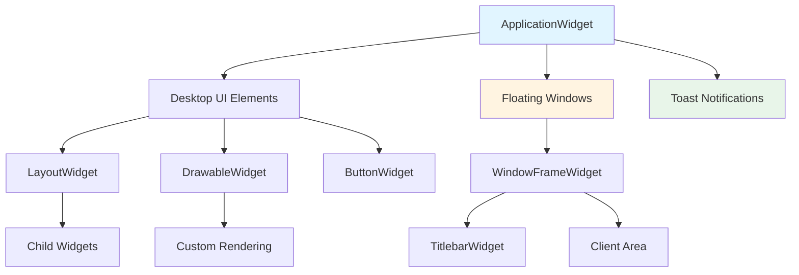
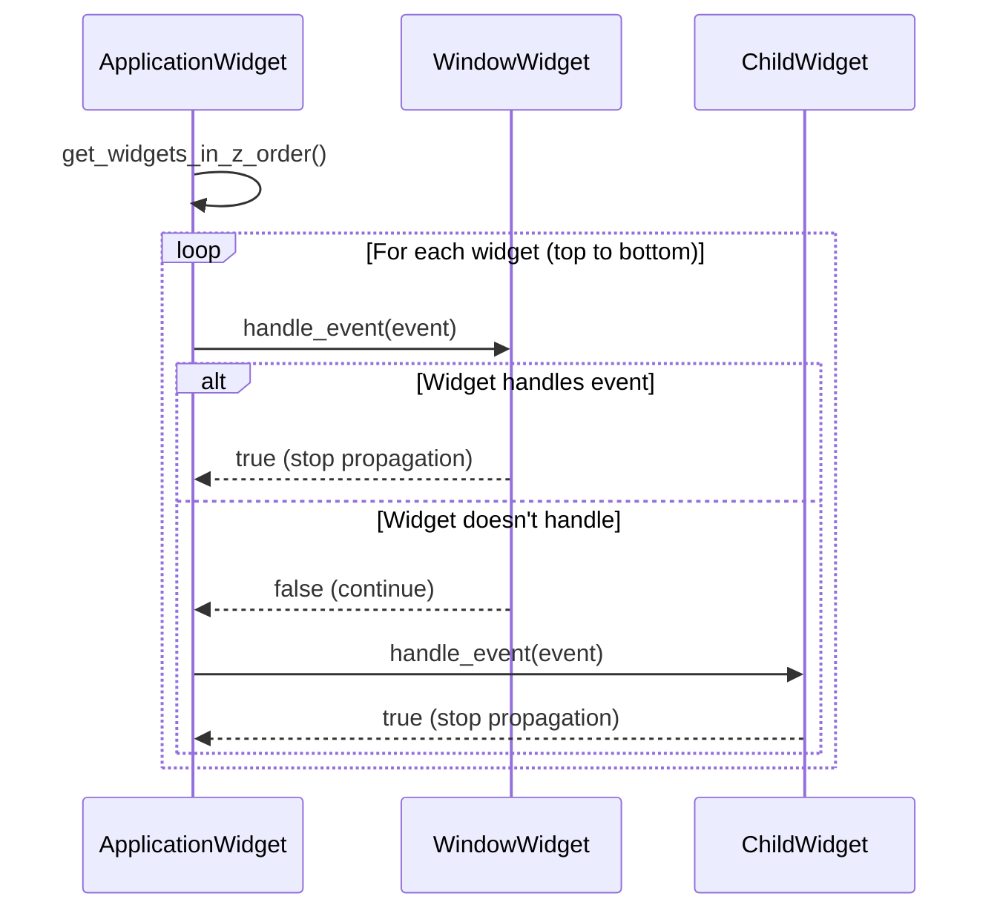

# Design Document: Widget and Windowing System

## Overview

This document describes the technical design for PsyMP3's Widget and Windowing System, a comprehensive UI framework providing hierarchical composition, Z-order management, event handling, and window management. The system supports desktop UI elements, floating windows, toast notifications, and transparent overlays with proper layering and interaction.

The design follows the Public/Private Lock Pattern for thread safety and uses SDL for cross-platform rendering. All widgets use surface-based rendering with proper compositing and alpha blending support.

## Architecture Overview

### System Components



### Class Hierarchy

```
Widget (abstract base)
├── DrawableWidget (abstract)
│   ├── LayoutWidget (abstract)
│   │   ├── WindowFrameWidget
│   │   └── TitlebarWidget
│   ├── ButtonWidget
│   ├── SpectrumAnalyzerWidget
│   ├── PlayerProgressBarWidget
│   ├── ToastWidget
│   └── TransparentWindowWidget
└── WindowWidget (abstract)
    └── TitlebarWidget (also inherits from LayoutWidget)
```

## Core Widget Architecture

### Widget Base Class

```pascal
CLASS Widget
  PRIVATE
    m_parent: Widget*
    m_children: List<Widget*>
    m_z_order: Integer
    m_visible: Boolean
    m_enabled: Boolean
    m_mouse_transparent: Boolean
    m_bounds: Rectangle
    m_surface: SDL_Surface*
    m_dirty: Boolean
    
  PUBLIC
    CONSTRUCTOR Widget(parent: Widget*, bounds: Rectangle, z_order: Integer)
    DESTRUCTOR ~Widget()
    
    // Lifecycle management
    FUNCTION add_child(widget: Widget*): void
    FUNCTION remove_child(widget: Widget*): void
    FUNCTION destroy(): void
    
    // Rendering
    FUNCTION render(): void
    FUNCTION invalidate(): void
    FUNCTION update(): void
    
    // Event handling
    FUNCTION handle_event(event: SDL_Event*): Boolean
    FUNCTION hit_test(x: Integer, y: Integer): Boolean
    FUNCTION transform_coordinates(x: Integer, y: Integer): Point
    
    // Properties
    FUNCTION get_bounds(): Rectangle
    FUNCTION set_bounds(bounds: Rectangle): void
    FUNCTION get_z_order(): Integer
    FUNCTION set_z_order(z_order: Integer): void
    FUNCTION is_visible(): Boolean
    FUNCTION set_visible(visible: Boolean): void
    FUNCTION is_mouse_transparent(): Boolean
    FUNCTION set_mouse_transparent(transparent: Boolean): void
    
  PRIVATE
    FUNCTION render_unlocked(): void
    FUNCTION handle_event_unlocked(event: SDL_Event*): Boolean
    FUNCTION render_children_unlocked(): void
    FUNCTION invalidate_unlocked(): void
END CLASS
```

### Key Design Decisions

1. **Ownership Model**: Parent widgets take ownership of children and manage their lifecycle
2. **Coordinate System**: All coordinates are relative to parent widget
3. **Rendering Order**: Children rendered after parent content
4. **Invalidation Propagation**: Invalidation propagates up to root
5. **Thread Safety**: Public methods acquire locks, private `_unlocked` methods assume locks held

## Z-Order Management System

### Z-Order Constants

```pascal
CONSTANT Z_ORDER_DESKTOP = 0
CONSTANT Z_ORDER_UI = 1
CONSTANT Z_ORDER_LOW = 10
CONSTANT Z_ORDER_NORMAL = 50
CONSTANT Z_ORDER_HIGH = 100
CONSTANT Z_ORDER_MAX = 999
```

### Z-Order Implementation

```pascal
CLASS ZOrderManager
  PRIVATE
    m_widgets: Map<Integer, List<Widget*>>
    m_mutex: std::mutex
    
  PUBLIC
    FUNCTION add_widget(widget: Widget*): void
    FUNCTION remove_widget(widget: Widget*): void
    FUNCTION get_widgets_in_z_order(): List<Widget*>
    FUNCTION bring_to_front(widget: Widget*): void
    
  PRIVATE
    FUNCTION add_widget_unlocked(widget: Widget*): void
    FUNCTION remove_widget_unlocked(widget: Widget*): void
    FUNCTION sort_z_order_unlocked(z_level: Integer): void
END CLASS
```

### Z-Order Usage

| Z-Order Level | Usage | Examples |
|---------------|-------|----------|
| 0 (DESKTOP) | Background elements | FFT visualization, main UI background |
| 1 (UI) | Overlays | Lyrics display, seek indicators |
| 10 (LOW) | Tool windows | Secondary panels, toolboxes |
| 50 (NORMAL) | Standard windows | Settings dialogs, file browsers |
| 100 (HIGH) | Modal dialogs | Critical alerts, confirmations |
| 999 (MAX) | Toasts | Notifications, status messages |

## Event Handling System

### Event Types

```pascal
TYPE EventData = STRUCTURE
  TYPE event_type = ENUM
    MOUSE_DOWN,
    MOUSE_UP,
    MOUSE_MOVE,
    MOUSE_DOUBLE_CLICK,
    MOUSE_DRAG_START,
    MOUSE_DRAG_MOVE,
    MOUSE_DRAG_END,
    KEY_DOWN,
    KEY_UP,
    WIDGET_RESIZE,
    WIDGET_MOVE,
    WIDGET_FOCUS_GAINED,
    WIDGET_FOCUS_LOST,
    WIDGET_SHUTDOWN,
    CUSTOM_EVENT
  END ENUM
  
  event_type type
  Point position
  Point delta
  Integer button
  Integer key_code
  Integer modifiers
  Void* user_data
END STRUCTURE

TYPE EventHandler = FUNCTION(event: EventData*): Boolean
```

### Event Delegation Flow



### Event Capture System

```pascal
CLASS EventCaptureManager
  PRIVATE
    m_captured_widget: Widget*
    m_capture_active: Boolean
    
  PUBLIC
    FUNCTION capture(widget: Widget*): void
    FUNCTION release(): void
    FUNCTION is_captured(): Boolean
    FUNCTION get_captured_widget(): Widget*
    
  PRIVATE
    FUNCTION capture_unlocked(widget: Widget*): void
    FUNCTION release_unlocked(): void
END CLASS
```

### Coordinate Transformation

```pascal
CLASS CoordinateTransformer
  PUBLIC
    FUNCTION transform_to_widget(widget: Widget*, x: Integer, y: Integer): Point
    FUNCTION transform_from_widget(widget: Widget*, x: Integer, y: Integer): Point
    FUNCTION hit_test_widget(widget: Widget*, x: Integer, y: Integer): Boolean
    
  PRIVATE
    FUNCTION get_absolute_position(widget: Widget*): Point
END CLASS
```

## Surface-Based Rendering

### Surface Management

```pascal
CLASS SurfaceManager
  PRIVATE
    m_surfaces: Map<Widget*, SDL_Surface*>
    m_mutex: std::mutex
    
  PUBLIC
    FUNCTION create_surface(widget: Widget*, width: Integer, height: Integer): SDL_Surface*
    FUNCTION destroy_surface(widget: Widget*): void
    FUNCTION get_surface(widget: Widget*): SDL_Surface*
    FUNCTION update_surface(widget: Widget*): void
    
  PRIVATE
    FUNCTION create_surface_unlocked(widget: Widget*, width: Integer, height: Integer): SDL_Surface*
    FUNCTION destroy_surface_unlocked(widget: Widget*): void
END CLASS
```

### Rendering Pipeline

```pascal
PROCEDURE render_widget(widget: Widget*)
  INPUT: widget to render
  OUTPUT: widget rendered to parent surface
  
  SEQUENCE
    // Acquire lock for thread safety
    lock_guard lock(m_mutex)
    
    // Render widget content
    widget->render_unlocked()
    
    // Render children in Z-order
    FOR each child IN widget->get_children() DO
      IF child->is_visible() THEN
        render_widget(child)
      END IF
    END FOR
    
    // Composite to parent
    IF widget->has_parent() THEN
      blit_surface(widget->get_surface(), 
                   widget->get_bounds(),
                   widget->get_parent()->get_surface())
    END IF
  END SEQUENCE
END PROCEDURE
```

### Invalidation System

```pascal
CLASS InvalidationManager
  PRIVATE
    m_invalid_regions: Map<Widget*, List<Rectangle>>
    m_mutex: std::mutex
    
  PUBLIC
    FUNCTION invalidate(widget: Widget*, region: Rectangle): void
    FUNCTION get_invalid_regions(widget: Widget*): List<Rectangle>
    FUNCTION clear_invalid(widget: Widget*): void
    FUNCTION process_invalidations(): void
    
  PRIVATE
    FUNCTION invalidate_unlocked(widget: Widget*, region: Rectangle): void
    FUNCTION process_invalidations_unlocked(): void
END CLASS
```

## Window Management System

### Window Structure

```pascal
CLASS WindowFrameWidget
  INHERITS LayoutWidget
  
  PRIVATE
    m_titlebar: TitlebarWidget*
    m_client_area: Widget*
    m_resize_handles: List<Widget*>
    m_window_state: WindowState
    m_min_size: Size
    m_max_size: Size
    
  PUBLIC
    CONSTRUCTOR WindowFrameWidget(parent: Widget*, 
                                   bounds: Rectangle,
                                   title: String)
    
    // Window operations
    FUNCTION close(): void
    FUNCTION minimize(): void
    FUNCTION maximize(): void
    FUNCTION restore(): void
    FUNCTION set_resizable(resizable: Boolean): void
    
    // Content management
    FUNCTION set_client_content(content: Widget*): void
    FUNCTION get_client_content(): Widget*
    
    // Properties
    FUNCTION get_title(): String
    FUNCTION set_title(title: String): void
    FUNCTION get_window_state(): WindowState
    
  PRIVATE
    FUNCTION handle_titlebar_event(event: EventData*): Boolean
    FUNCTION handle_resize_event(event: EventData*): Boolean
    FUNCTION update_window_layout_unlocked(): void
END CLASS
```

### Window State Management

```pascal
TYPE WindowState = ENUM
  NORMAL,
  MINIMIZED,
  MAXIMIZED
END ENUM

CLASS WindowStateManager
  PUBLIC
    FUNCTION calculate_resized_bounds(original: Rectangle,
                                       new_size: Size,
                                       state: WindowState): Rectangle
    FUNCTION calculate_resized_bounds_unlocked(original: Rectangle,
                                                new_size: Size,
                                                state: WindowState): Rectangle
END CLASS
```

### Window Lifecycle Events

```pascal
TYPE WindowEvent = ENUM
  WINDOW_CREATED,
  WINDOW_SHOWN,
  WINDOW_HIDDEN,
  WINDOW_RESIZED,
  WINDOW_MOVED,
  WINDOW_CLOSE_REQUESTED,
  WINDOW_CLOSED,
  WINDOW_MINIMIZED,
  WINDOW_MAXIMIZED,
  WINDOW_RESTORED,
  WINDOW_FOCUS_GAINED,
  WINDOW_FOCUS_LOST,
  WINDOW_SHUTDOWN
END ENUM

TYPE WindowCallback = FUNCTION(event: WindowEvent, data: Void*): Void
```

## ApplicationWidget Root Management

### Root Widget Design

```pascal
CLASS ApplicationWidget
  INHERITS Widget
  
  PRIVATE
    m_instance: static ApplicationWidget*
    m_desktop_widgets: List<Widget*>
    m_windows: List<WindowFrameWidget*>
    m_toasts: List<ToastWidget*>
    m_z_order_manager: ZOrderManager*
    m_event_capture_manager: EventCaptureManager*
    m_surface_manager: SurfaceManager*
    m_invalidator: InvalidationManager*
    
  PUBLIC
    // Singleton access
    STATIC FUNCTION get_instance(): ApplicationWidget*
    STATIC FUNCTION create_instance(screen_width: Integer, 
                                     screen_height: Integer): void
    STATIC FUNCTION destroy_instance(): void
    
    // Desktop management
    FUNCTION add_desktop_widget(widget: Widget*): void
    FUNCTION remove_desktop_widget(widget: Widget*): void
    
    // Window management
    FUNCTION add_window(window: WindowFrameWidget*): void
    FUNCTION remove_window(window: WindowFrameWidget*): void
    FUNCTION bring_window_to_front(window: WindowFrameWidget*): void
    
    // Toast management
    FUNCTION show_toast(message: String, duration: Integer = SHORT): void
    FUNCTION dismiss_toast(toast: ToastWidget*): void
    
    // Event handling
    FUNCTION handle_event(event: SDL_Event*): Boolean
    FUNCTION render(): void
    
    // Lifecycle
    FUNCTION shutdown(): void
    
  PRIVATE
    FUNCTION handle_event_unlocked(event: SDL_Event*): Boolean
    FUNCTION render_unlocked(): void
    FUNCTION process_toasts_unlocked(): void
END CLASS
```

### Rendering Order

```pascal
PROCEDURE render()
  SEQUENCE
    // Clear screen
    SDL_FillRect(m_surface, NULL, 0x000000)
    
    // Render desktop widgets (Z-order 0-10)
    render_widgets_by_z_order(0, 10)
    
    // Render windows (Z-order 10-999)
    render_widgets_by_z_order(10, 999)
    
    // Render toasts (Z-order 999)
    render_widgets_by_z_order(999, 999)
    
    // Update display
    SDL_UpdateWindowSurface(m_window)
  END SEQUENCE
END PROCEDURE
```

## Specialized Widget Types

### ToastWidget

```pascal
CLASS ToastWidget
  INHERITS Widget
  
  PRIVATE
    m_message: String
    m_duration: Integer
    m_start_time: Uint32
    m_dismiss_callback: Void(*)(Void*)
    m_user_data: Void*
    
  PUBLIC
    CONSTRUCTOR ToastWidget(parent: Widget*, 
                            message: String,
                            duration: Integer = SHORT)
    
    // Toast operations
    FUNCTION update(dt: Uint32): Boolean
    FUNCTION set_dismiss_callback(callback: Void(*)(Void*), 
                                   user_data: Void*): void
    
    // Properties
    FUNCTION get_message(): String
    FUNCTION set_message(message: String): void
    
  PRIVATE
    FUNCTION render_unlocked(): void
    FUNCTION is_expired(current_time: Uint32): Boolean
END CLASS
```

### TransparentWindowWidget

```pascal
CLASS TransparentWindowWidget
  INHERITS Widget
  
  PRIVATE
    m_opacity: Float
    m_mouse_transparent: Boolean
    
  PUBLIC
    CONSTRUCTOR TransparentWindowWidget(parent: Widget*, 
                                         bounds: Rectangle,
                                         opacity: Float = 0.7)
    
    // Properties
    FUNCTION get_opacity(): Float
    FUNCTION set_opacity(opacity: Float): void
    FUNCTION is_mouse_transparent(): Boolean
    FUNCTION set_mouse_transparent(transparent: Boolean): void
    
  PRIVATE
    FUNCTION render_unlocked(): void
END CLASS
```

### ButtonWidget

```pascal
CLASS ButtonWidget
  INHERITS DrawableWidget
  
  PRIVATE
    m_text: String
    m_font: SDL_Font*
    m_pressed: Boolean
    m_hovered: Boolean
    m_click_callback: Void(*)(Void*)
    m_user_data: Void*
    
  PUBLIC
    CONSTRUCTOR ButtonWidget(parent: Widget*, 
                             bounds: Rectangle,
                             text: String)
    
    // Button operations
    FUNCTION set_click_callback(callback: Void(*)(Void*), 
                                 user_data: Void*): void
    FUNCTION click(): void
    
    // Properties
    FUNCTION get_text(): String
    FUNCTION set_text(text: String): void
    
  PRIVATE
    FUNCTION render_unlocked(): void
    FUNCTION handle_event_unlocked(event: EventData*): Boolean
END CLASS
```

## Thread Safety Implementation

### Lock Acquisition Order

```pascal
// MANDATORY: Document lock acquisition order at class level
// Lock acquisition order (to prevent deadlocks):
// 1. Global/Static locks (e.g., ApplicationWidget::s_instance_mutex)
// 2. Manager-level locks (e.g., ZOrderManager::m_mutex)
// 3. Widget instance locks (e.g., Widget::m_mutex)
// 4. System locks (e.g., SDL surface locks)
```

### Thread-Safe Widget Pattern

```pascal
CLASS Widget
  PUBLIC
    // Public API - acquires locks
    FUNCTION render(): void {
      lock_guard lock(m_mutex)
      render_unlocked()
    }
    
    FUNCTION handle_event(event: SDL_Event*): Boolean {
      lock_guard lock(m_mutex)
      return handle_event_unlocked(event)
    }
    
  PRIVATE
    // Private implementation - assumes locks held
    FUNCTION render_unlocked(): void {
      // Actual rendering implementation
    }
    
    FUNCTION handle_event_unlocked(event: SDL_Event*): Boolean {
      // Actual event handling implementation
    }
    
    mutable mutex m_mutex
END CLASS
```

### Cross-Thread UI Updates

```pascal
CLASS UIThreadDispatcher
  PRIVATE
    m_event_queue: Queue<EventData*>
    m_mutex: std::mutex
    m_condition: std::condition_variable
    
  PUBLIC
    FUNCTION post_event(event: EventData*): void
    FUNCTION process_events(): void
    
  PRIVATE
    FUNCTION post_event_unlocked(event: EventData*): void
    FUNCTION process_events_unlocked(): void
END CLASS
```

## Performance Considerations

### Rendering Optimization

1. **Selective Invalidation**: Only invalidate regions that changed
2. **Surface Reuse**: Reuse surfaces when possible
3. **Culling**: Skip rendering of invisible widgets
4. **Batching**: Batch similar operations

### Memory Management

1. **Object Pooling**: Pool frequently created objects
2. **Smart Pointers**: Use shared_ptr for widget ownership
3. **Lazy Allocation**: Allocate surfaces only when needed

### Event Processing

1. **Event Filtering**: Filter events before processing
2. **Batch Processing**: Process events in batches when possible
3. **Deferred Updates**: Defer expensive operations

## Error Handling

### Exception Safety

```pascal
// All public methods use RAII lock guards
// Locks are automatically released even on exceptions
// Widget destruction is exception-safe
```

### Error Recovery

1. **Surface Creation Failures**: Gracefully handle SDL surface allocation failures
2. **Event Processing Errors**: Continue processing other events after errors
3. **Rendering Failures**: Fall back to safe rendering mode

## Dependencies

### External Dependencies

- SDL2 for windowing and rendering
- SDL_ttf for font rendering
- Standard C++17 library

### Internal Dependencies

- Debug logging system
- Memory management utilities
- Resource management system

## Testing Strategy

### Unit Tests

1. **Widget Hierarchy**: Test parent-child relationships
2. **Z-Order Management**: Test layering order
3. **Event Handling**: Test event delegation
4. **Rendering**: Test surface compositing
5. **Window Management**: Test window operations

### Integration Tests

1. **Full UI Rendering**: Test complete UI rendering
2. **Event Flow**: Test event propagation
3. **Thread Safety**: Test concurrent access
4. **Performance**: Test rendering performance

### Property-Based Tests

1. **Z-Order Properties**: Verify layering invariants
2. **Event Properties**: Verify event propagation rules
3. **Rendering Properties**: Verify compositing correctness
## Implementation Guidelines

### Widget Creation Pattern

```pascal
// Create widget with parent
auto button = new ButtonWidget(parent, Rectangle(10, 10, 100, 30), "Click Me");

// Add to parent (parent takes ownership)
parent->add_child(button);

// Set Z-order
button->set_z_order(Z_ORDER_NORMAL);

// Make visible
button->set_visible(true);
```

### Event Handler Pattern

```pascal
// Implement event handler
Boolean MyWidget::handle_event_unlocked(EventData* event) {
  switch (event->type) {
    case MOUSE_DOWN:
      return handle_mouse_down(event->position.x, event->position.y);
    case MOUSE_UP:
      return handle_mouse_up(event->position.x, event->position.y);
    case MOUSE_MOVE:
      return handle_mouse_move(event->position.x, event->position.y);
    default:
      return false;  // Continue propagation
  }
}
```

### Window Creation Pattern

```pascal
// Create window
auto window = new WindowFrameWidget(root, Rectangle(100, 100, 400, 300), "My Window");

// Set client content
auto content = new LayoutWidget(window, Rectangle(10, 40, 380, 250));
window->set_client_content(content);

// Add to root
root->add_window(window);

// Show window
window->set_visible(true);
```

### Toast Notification Pattern

```pascal
// Show toast
auto toast = new ToastWidget(root, "Operation completed", ToastWidget::SHORT);
toast->set_dismiss_callback(on_toast_dismiss, user_data);
root->show_toast(toast);
```

## Migration Path

### Phase 1: Core Widget System

1. Implement Widget base class with hierarchy
2. Implement surface-based rendering
3. Implement Z-order management
4. Implement event handling

### Phase 2: Window System

1. Implement WindowFrameWidget
2. Implement TitlebarWidget
3. Implement window lifecycle management
4. Implement window decorations

### Phase 3: Specialized Widgets

1. Implement ToastWidget
2. Implement TransparentWindowWidget
3. Implement ButtonWidget
4. Implement LayoutWidget

### Phase 4: Application Integration

1. Implement ApplicationWidget singleton
2. Integrate with existing UI elements
3. Add window management to application
4. Implement toast notification system

## Design Principles

1. **Hierarchical Composition**: Widgets compose naturally in parent-child relationships
2. **Z-Order Layering**: Clear separation of UI layers with defined constants
3. **Event Delegation**: Events flow through hierarchy with capture support
4. **Surface Rendering**: Each widget has its own surface for compositing
5. **Thread Safety**: Public/Private Lock Pattern for all multi-threaded classes
6. **Performance**: Selective invalidation and efficient rendering
7. **Cross-Platform**: SDL-based for consistent behavior across platforms
8. **Extensibility**: Abstract base classes for easy extension

## Future Enhancements

1. **Animation System**: Support for widget animations and transitions
2. **Layout Managers**: Advanced layout algorithms (flexbox, grid)
3. **Theme System**: Configurable visual styling
4. **Accessibility**: Keyboard navigation and screen reader support
5. **GPU Acceleration**: Optional GPU rendering path
6. **Web Integration**: HTML/CSS-based UI option
