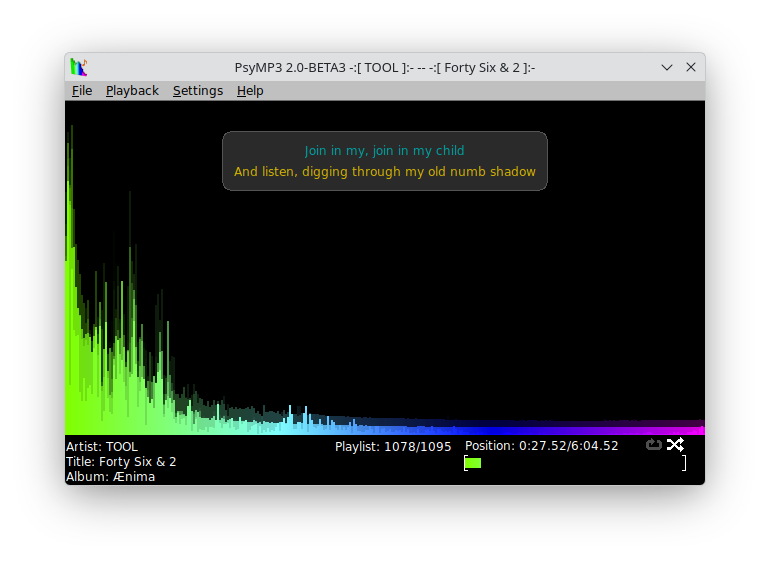

# PsyMP3 2-CURRENT

A simplistic audio media player with a flashy Fourier transform.



## Table of Contents

1. [Overview](#overview)
2. [System Requirements](#system-requirements)
3. [Building](#building)
4. [Usage](#usage)
5. [Testing](#testing)
6. [Notes](#notes)

## Overview

PsyMP3 2.x is a radical departure from the code of the 1.x series. Whereas 1.x was written in FreeBASIC, 2.x is written in C++17, and is portable!

> **Note**: The "2-CURRENT" version tag represents the active development branch. End users should be aware that this is pre-release software.

**Contact**: <segin2005@gmail.com>

## System Requirements

### Windows
- Windows 10 or later
- Official builds are cross-compiled with [llvm-mingw](https://github.com/mstorsjo/llvm-mingw)
  (x86_64, i686, and ARM64), statically linked against SDL3; building under
  MSYS2 is also possible

### Linux/BSD
**Core dependencies** (always required):
- SDL3 3.0 or later (`sdl3`)
- FreeType2 (`freetype2`)
- taglib 1.6 or later (`taglib`; taglib 2.x works too)
- OpenSSL 1.0 or later (`openssl`)
- libcurl 7.20.0 or later (`libcurl`)

**Optional codec dependencies** (auto-detected; each can be disabled at build time):
- libogg (`ogg`) — required for Vorbis, Opus, and Ogg FLAC
- libvorbis (`vorbis`) — Ogg Vorbis
- libopus (`opus`) — Opus
- faad2 (`faad2`) — AAC
- speex 1.2 or later (`speex`) — Speex
- spandsp (`spandsp`) — G.722

**Bundled codecs** (vendored, no external dependency):
- FLAC — native decoder (no libFLAC needed)
- MP3 — minimp3 (`third_party/minimp3`)
- MP2 — kjmp2 (`third_party/kjmp2`)
- ALAC — Apple's reference decoder (`third_party/alac`)

**Optional integration dependencies**:
- D-Bus 1.0 or later (`dbus-1`) — MPRIS desktop media control
- A GUI toolkit for the native file-open/save dialog. Configure probes, in
  order, and uses the first one found:
  **Qt 6** (`Qt6Widgets`) → **Qt 5** (`Qt5Widgets`) → **Qt 4** (`QtGui`) →
  **Qt 3** (no pkg-config; opt in with `--with-qt3-dir=PREFIX`) →
  **GTK 4** (`gtk4`) → **GTK+ 3** (`gtk+-3.0`) → **GTK+ 2** (`gtk+-2.0`).
  Without any of these, the file dialogs are unavailable but PsyMP3 still
  builds and plays files given on the command line.

### Build Requirements
- C++17 compliant compiler (GCC 9+, Clang 10+, MSVC 2019+)
- Autotools: `autoconf`, `automake`, `libtool`, and **`autoconf-archive`**
  (required — it supplies `AX_CXX_COMPILE_STDCXX_17`; without it `autoreconf`
  silently drops the C++17 check and the build fails with `-std=c++17` errors)
- `pkg-config`
- Optional, for `make check`: [RapidCheck](https://github.com/emil-e/rapidcheck)
  (property-based tests, enabled with `--enable-rapidcheck`)

## Building

**From a release tarball:**
```bash
./configure
make -j$(nproc)
```

**From git** (requires autoconf-archive):
```bash
./generate-configure.sh
./configure
make -j$(nproc)
```

**Build Options:**
- `--enable-flac` - Enable FLAC support (default: yes)
- `--enable-vorbis` - Enable Vorbis support (default: yes)
- `--enable-opus` - Enable Opus support (default: yes)
- `--enable-dbus` - Enable MPRIS integration (default: yes)
- `--enable-test-harness` - Build test harness (default: yes)
- `--enable-asan` - Enable AddressSanitizer (debug only)
- `--enable-tsan` - Enable ThreadSanitizer (debug only)

## Usage

Pass the paths to the audio files to be played as program arguments. Supported formats include MP3, Ogg Vorbis, Opus, FLAC, and RIFF WAVE. Audio files will be played in the order they are passed on the command line.

All user interaction, aside from clicking the 'close' button for the window, is done via the keyboard.

### Keyboard Controls

| Key | Action |
|-----|--------|
| `ESC`, `Q` | Quit PsyMP3 |
| `Space` | Pause (or resume) playback |
| `R` | Restart the current track from the beginning |
| `N` | Seek to the next track |
| `P` | Seek to the previous track |

### Command-line Options

- `--debug` - Enable debug logging to the console (can specify comma-separated channels)
- `--logfile <file>` - Write debug logs to the specified file

### Last.fm Scrobbling

PsyMP3 includes built-in Last.fm scrobbling support to automatically track your music listening history.

**Configuration file locations:**
- **Linux/Unix**: `~/.config/psymp3/lastfm.conf`
- **Windows**: `%APPDATA%\PsyMP3\lastfm.conf`

**Configuration file format:**
```ini
# Last.fm configuration
username=your_lastfm_username
password=your_lastfm_password
```

### MPRIS Desktop Integration

PsyMP3 includes built-in MPRIS (Media Player Remote Interfacing Specification) support for seamless desktop media control integration (Linux/BSD only).

## Testing

To run the full test suite:

```bash
make check
```

For detailed testing information, see [TESTING.md](TESTING.md).

## Notes

**Unicode Support**: Unicode ID3 tags are supported. PsyMP3 renders UI text through the built-in FreeType path; replace the bundled `vera.ttf` with a font file containing the glyph coverage you want. On Windows, dropping a `vera.ttf` next to `psymp3.exe` (or in the working directory) overrides the font embedded in the exe — no rebuild needed.

---

*This README is auto-updated as part of the implementation plan.*
