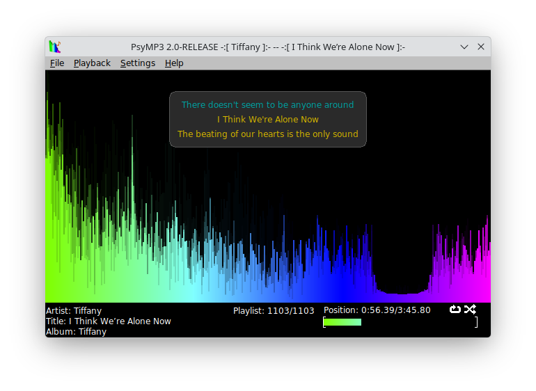

# PsyMP3

PsyMP3 is a music player written in C++ for Linux, the BSDs and Windows that
shows a live spectrum analyzer of whatever it is playing. It plays MP3, AAC,
FLAC, Vorbis, Opus, ALAC, AC-3, Dolby TrueHD and more. Files can be
standalone or inside Ogg, Matroska, MP4 or AVI containers, and most decoders
are built in, so it needs few outside libraries. Around the visualizer is a
software-drawn interface in the style of Windows 3.1, with a menu bar and
movable windows for the playlist, equalizer and track information. It also
shows synced lyrics, scrobbles to Last.fm, and shows what's playing in
Discord. On Linux and the BSDs, builds with D-Bus support can also be
controlled from the desktop's media keys and now-playing widgets through
MPRIS.



## Table of Contents

1. [Features](#features)
2. [System Requirements](#system-requirements)
3. [Building](#building)
4. [Usage](#usage)
5. [Integrations](#integrations)
6. [Testing](#testing)
7. [Notes](#notes)

## Features

- Real-time FFT spectrum visualizer with adjustable intensity, decay, and draw modes
- A faithful Windows 3.1-style in-app UI: menu bar, movable windows (Playlist Manager, Equalizer, Media Information, About), buttons, checkboxes, radio buttons, drop-down lists, text fields, scrollbars, and dialogs — all software-rendered, and usable from the keyboard
- Wide format support through a modular demuxer/codec architecture, with most codecs built in so they work with no external libraries
- Plays local files, or an `http://` / `https://` address (**File → Open URL...**); files can also be dragged onto the window
- Synced lyrics display (`.lrc` files)
- Last.fm scrobbling (Web Services API 2.0), MPRIS desktop control, and Discord Rich Presence
- Session persistence: with Persist Playlist enabled, PsyMP3 reopens your playlist at the track you were playing

**Contact**: <segin2005@gmail.com>

## System Requirements

### Windows
- Windows 10 or later
- Official builds are cross-compiled with [llvm-mingw](https://github.com/mstorsjo/llvm-mingw)
  (x86_64, i686, and ARM64), statically linked against SDL3; building under
  MSYS2 is also possible
- Releases also carry separate builds for Windows XP: `winxp` (32-bit, needs a
  CPU with SSE2) and `winxp64` (XP x64 and Server 2003 x64)

### Linux/BSD
**Core dependencies** (always required):
- SDL3 3.0 or later (`sdl3`)
- FreeType2 (`freetype2`)
- HarfBuzz (`harfbuzz`) — shapes Arabic and the Indic scripts
- taglib 1.6 or later (`taglib`; taglib 2.x works too)
- OpenSSL 1.0 or later (`openssl`)
- libcurl 7.20.0 or later (`libcurl`)

**Optional codec dependencies** (auto-detected; each can be disabled at build time):
- libogg (`ogg`) — required for Vorbis, Opus, Speex and Ogg FLAC (container parsing)
- libopus (`opus`) — Opus
- FDK-AAC (`fdk-aac`) — the whole AAC family: AAC-LC, HE-AACv1, HE-AACv2 and
  xHE-AAC / MPEG-D USAC. Note that it is not packaged everywhere: Debian
  keeps it in `non-free`, openSUSE in Packman, and Ubuntu in `universe`.
  Fedora ships only the stripped `fdk-aac-free`, against which PsyMP3 builds
  without AAC rather than decoding HE-AAC at half its bandwidth.
- speex 1.2 or later (`speex`) — Speex

**Bundled codecs** (vendored, no external dependency):
- FLAC — native decoder (no libFLAC needed)
- Vorbis — stb_vorbis (`third_party/stb`; needs only libogg for the container)
- MP3 — minimp3 (`third_party/minimp3`)
- MP2 — kjmp2 (`third_party/kjmp2`)
- ALAC — Apple's reference decoder (`third_party/alac`)
- MLP / Dolby TrueHD — bundled decoder (`third_party/mlp`), derived from
  [truehdd](https://github.com/truehdd/truehdd) © 2025 Rainbaby (Apache-2.0)
- AC-3 and E-AC-3 (Dolby Digital and Dolby Digital Plus) — written in tree
  from ATSC A/52
- G.722 — written in tree from the ITU-T Recommendation
- G.711 µ-law/A-law, and raw PCM formats

**Optional integration dependencies**:
- D-Bus 1.0 or later (`dbus-1`) — MPRIS desktop media control
- A GUI toolkit for the native file-open/save dialog. Configure probes, in
  order, and uses the first one found:
  **Qt 6** (`Qt6Widgets`) → **Qt 5** (`Qt5Widgets`) → **Qt 4** (`QtGui`) →
  **Qt 3** (no pkg-config; opt in with `--with-qt3-dir=PREFIX`) →
  **GTK 4** (`gtk4`) → **GTK+ 3** (`gtk+-3.0`) → **GTK+ 2** (`gtk+-2.0`).
  Without any of these (or with `--disable-filedialog`), the file dialogs are
  unavailable but PsyMP3 still builds, and plays files given on the command
  line, dragged onto it, or opened by URL. Windows builds use the system's own
  file dialog and need no toolkit.

### Build Requirements
- A C++17 compiler: GCC (10 is the oldest checked) or Clang. The build is
  autotools only; there is no MSVC project.
- `pkg-config` (or pkgconf)
- Optional, for `make check`: [RapidCheck](https://github.com/emil-e/rapidcheck)
  (property-based tests, enabled with `--enable-rapidcheck`)

Building from git needs these as well, to generate `configure`:

- `autoconf` 2.69 or later, which provides `autoconf` and `autoheader`
- `automake` 1.10 or later, which provides `automake` and `aclocal`
- **`autoconf-archive`**, for `AX_CXX_COMPILE_STDCXX_17`. Nothing reports it
  missing: `autoreconf` succeeds and leaves the macro in `configure` as a
  bare word, so `configure` never turns on C++17 and the build fails later
  with C++17 errors.
- `pkg-config` again, this time for the `pkg.m4` macros (`PKG_CHECK_MODULES`)
  it installs into aclocal's directory

`libtool` is not needed.

## Building

**From git**, or from GitHub's "Source code" downloads, which are snapshots of
the repository and do not include `configure`:
```bash
./generate-configure.sh
./configure
make -j$(nproc)
```

Use `generate-configure.sh` to generate `configure` rather than running
`autoreconf` yourself. Besides running `autoreconf -fiv`, it:

- installs the repository's git hooks (`core.hooksPath=.githooks`). The
  pre-commit hook advances the build number in `res/psymp3.rc`, which has to
  go up with every commit.
- deletes what an earlier run generated (`configure`, `aclocal.m4`, every
  `Makefile.in`, `autom4te.cache`) first, so nothing stale is left behind
- stops early if `aclocal`, `automake`, `autoconf` or `autoheader` is missing,
  and checks afterwards that `./configure --help` runs

`autogen.sh` is a symbolic link to it, for tools that expect that name.

**From a `make dist` tarball**, `configure` is already there:
```bash
./configure
make -j$(nproc)
```

**Build Options:**
- `--enable-flac` / `--enable-vorbis` / `--enable-opus` / `--enable-aac` /
  `--enable-speex` / `--enable-g722` / `--enable-g711` — per-codec toggles
  (default: yes). `--enable-alaw` and `--enable-mulaw` switch the two G.711
  codecs separately.
- `--enable-mp2` / `--enable-ac3` / `--enable-truehd` — the codecs that need
  nothing external: MPEG Layer II through the bundled kjmp2, AC-3 and E-AC-3
  written in tree from ATSC A/52, and MLP/Dolby TrueHD through the vendored
  decoder (default: yes). Disabling one leaves its files unplayable: nothing
  registers the codec, and nothing claims the format.
- `--enable-matroska` — the Matroska and WebM container, parsers and all
  (default: yes). Disabling it leaves `.mka`, `.mkv` and `.webm` unreadable.
- `--enable-mpris` — MPRIS desktop integration over D-Bus (default: auto)
- `--disable-filedialog` — build without the native file dialog, even if a
  toolkit is installed
- `--with-qt3-dir=PREFIX` — use Qt 3 for the file dialog (see above)
- `--enable-final` — unity build: all sources in one translation unit (much
  faster full rebuilds; used for release builds)
- `--enable-release` — a release build, which leaves out the development-only
  test window (the `H` key). The default follows the version: yes for a
  release, beta or RC, no for a `-CURRENT` development snapshot.
- `--enable-optimize` — optimize aggressively (`-O3`, `NDEBUG`) and strip debug
  symbols (default: no). Independent of `--enable-release`, so a release can
  still be built with its symbols.
- `--enable-static-binary` — fully static, self-contained executable (used for
  the Windows release builds)
- `--enable-test-harness` — build the test harness (default: yes on Unix; no
  on Windows and in `--enable-final` builds)
- `--enable-rapidcheck` — build the property-based tests, which need RapidCheck
- `--enable-asan` / `--enable-ubsan` / `--enable-tsan` — sanitizer builds

### Distribution packages

`package/` holds native packaging. The `.deb` and `.rpm` packages are built
for every push by the [Linux packages](.github/workflows/packages.yml)
workflow; the Arch package is built by hand with `makepkg`:

| Format | Targets |
|---|---|
| `.deb` | Debian 13 (trixie), Ubuntu 26.04 LTS |
| `.rpm` | Fedora, openSUSE Tumbleweed |
| `.pkg.tar.zst` | Arch Linux (`package/arch/PKGBUILD`) |

```bash
./package/dpkg/build-deb.sh      # -> package/dpkg/out/*.deb
./package/rpm/build-rpm.sh       # -> package/rpm/out/*.rpm
(cd package/arch && makepkg)     # -> package/arch/*.pkg.tar.zst
```

All three build from what is committed, so commit before packaging. See
[package/README.md](package/README.md) for the dependency-installation
one-liners and how the version label is mapped to a legal package version.

## Usage

Pass the paths of audio files or playlists (`.m3u`/`.m3u8`) as program
arguments; they are played in order. Once running, open files with
**File → Open Tracks...**, drag them onto the window, or play an `http://` or
`https://` address with **File → Open URL...**. Internet radio streams
(Icecast/SHOUTcast) are not supported.

### Supported formats

| Container | Extensions | Audio it can carry |
|---|---|---|
| MPEG audio | `.mp3`, `.mp2`, `.mpa` | MP3, MP2 |
| FLAC | `.flac` | FLAC |
| Ogg | `.ogg`, `.oga`, `.opus` | Vorbis, Opus, FLAC, Speex |
| MP4 / QuickTime | `.m4a`, `.mp4`, `.mov`, `.3gp` | AAC (LC, HE-AAC v1/v2, xHE-AAC), ALAC, MP3, FLAC, AC-3, E-AC-3, TrueHD, PCM |
| Matroska / WebM | `.mka`, `.mkv`, `.webm` | AAC, Vorbis, Opus, FLAC, ALAC, MP2, MP3, AC-3, E-AC-3, MLP / TrueHD, PCM |
| RIFF | `.wav`, `.bwf`, `.avi` | PCM, G.711, G.722, MP2, MP3, AC-3 (AVI: the audio track only) |
| AIFF | `.aif`, `.aiff`, `.aifc` | PCM, G.711 |
| Dolby | `.ac3`, `.eac3`, `.thd`, `.mlp` | AC-3, E-AC-3, MLP / Dolby TrueHD |
| Raw | `.pcm`, `.raw`, `.al`, `.ul`, `.g722`, `.au` | PCM, G.711 µ-law/A-law, G.722 |

Playlists in `.m3u` and `.m3u8` are read and written.

PsyMP3 has a full mouse-driven UI — a menu bar (`File`, `Playback`,
`Settings`, `Help` — the Alt+F/P/S/H mnemonics work) plus movable in-app windows
like the Playlist Manager, Equalizer, and Media Information — and everything
is also reachable from the keyboard.

### Keyboard Controls

| Key | Action |
|-----|--------|
| `ESC`, `Q` | Quit PsyMP3 |
| `Space` | Pause (or resume) playback |
| `R` | Restart the current track from the beginning |
| `N` / `P` | Next / previous track |
| `Left` / `Right` | Seek backward / forward (hold to keep seeking) |
| `Up` / `Down` | Volume up / down |
| `S` | Toggle shuffle |
| `E` | Cycle loop mode (`Shift+E` opens the Equalizer) |
| `Shift+P` | Playlist Manager |
| `F1` | About PsyMP3 |
| `F` | Cycle FFT draw mode |
| `G` | Toggle 2× zoom |
| `0`–`4` | Spectrum intensity |
| `Z` / `X` / `C` | Spectrum decay (fast/normal/slow) |
| `Ctrl+O` | Open tracks (replaces playlist) |
| `I` / `L` | Queue tracks next / play a track now |
| `Ctrl+S` | Save playlist |
| `Ctrl+F4` | Close the active in-app window |
| `Tab` / `Shift+Tab` | Move between the controls of the active window |

`Ctrl+O`, `I` and `L` open a file dialog, so they need a build with one. These
keys are the player's own: while a text field or another control in a dialog
has focus, the keys go to it instead.

### Command-line Options

- `-h`, `--help` - Print usage, including the list of debug channels
- `-v`, `--version` - Print version and licensing information
- `--licenses` - Print the copyright and third-party license texts
- `--fft=MODE` - Start in an FFT draw mode: `mat-og`, `vibe-1`, `neomat-in` or `neomat-out`
- `--scale=FACTOR` - Set the spectrum's scale factor
- `--decay=FACTOR` - Set the spectrum's decay factor
- `--debug=CHANNELS` - Enable debug logging (comma-separated channels, or `all`)
- `--logfile=FILE` - Write debug logs to the specified file
- `--unattended-quit` - Quit when playback ends
- `--no-mpris-errors` - Don't show on-screen notifications for MPRIS errors

## Integrations

### Last.fm Scrobbling

PsyMP3 scrobbles through the Last.fm Web Services API 2.0 with its own
registered API key. The easiest way to set it up is in the app:
**Settings → Last.fm Credentials...** — enter your username and password,
press **Test** to verify, and **OK** to save. The password is only needed
once: after the first successful login PsyMP3 saves a permanent session key
to the configuration file and removes the password from it. If you later
revoke PsyMP3's access on Last.fm, enter your password again under
**Settings → Last.fm Credentials...**.

Configuration lives in:
- **Linux/Unix**: `~/.config/psymp3/lastfm.conf` (or under `$XDG_CONFIG_HOME/psymp3/`
  when that is set)
- **Windows**: `%APPDATA%\PsyMP3\lastfm.conf`

and can also be created by hand:
```ini
# Last.fm configuration
username=your_lastfm_username
password=your_lastfm_password
```

Scrobbles and now-playing updates include MusicBrainz recording IDs when
your files are tagged with them (e.g. by MusicBrainz Picard), and failed
submissions are cached and retried across sessions.

### MPRIS Desktop Integration

PsyMP3 implements MPRIS (Media Player Remote Interfacing Specification) for
desktop media-control integration — play/pause/seek from your desktop
environment, media keys, and now-playing applets (Linux/BSD only).

### Discord Rich Presence

With Discord running on the same machine, PsyMP3 shows what you're listening
to as a Discord activity: artist in the header, track and album on the card,
a live progress bar, and album art from the Cover Art Archive (via your
files' MusicBrainz tags, or a live MusicBrainz lookup for untagged files).
Toggle it under **Settings → Discord Presence**. No Discord SDK or account
linking is required.

## Testing

To run the full test suite:

```bash
make check
```

For detailed testing information, see [TESTING.md](TESTING.md).

## Notes

**Unicode Support**: Unicode ID3 tags are supported. PsyMP3 renders UI text
through the built-in FreeType path, with **HarfBuzz** shaping each run and a
vendored **SheenBidi** resolving direction, so complex scripts are laid out
properly rather than drawn one codepoint at a time, left to right.

The bundled `vera.ttf` (DejaVu Sans) covers rather more than Latin, Greek and
Cyrillic. It also carries Armenian, Georgian, Lao, Hebrew, N'Ko and the Arabic
script — Arabic itself along with Persian, Sindhi, Sorani Kurdish and Uyghur,
and most of Urdu and Pashto. **Arabic letters join properly with the bundled
font**: shaping selects the contextual forms, and the renderer composites
overlapping glyph boxes so the stroke that joins one letter to the next
survives instead of being overwritten by its neighbour. Hebrew and N'Ko read
right to left.

Scripts that DejaVu Sans does not cover draw as empty boxes — Chinese,
Japanese and Korean are the most common example, along with many Indic and
Southeast Asian scripts, among others — until you give PsyMP3 a second font.

### Adding languages with `extra.ttf`

`extra.ttf` is an optional second font. PsyMP3 uses it for any character
`vera.ttf` cannot draw, so a single file can add whichever languages you need.
Any TrueType or OpenType font works; a family with broad coverage, such as
Noto, covers most scripts at once. Without an `extra.ttf`, nothing changes.

Where PsyMP3 looks for it:

| Platform | Location |
|---|---|
| Windows | next to `psymp3.exe`; otherwise `extra.ttf` or `res\extra.ttf` in the working directory |
| Linux/BSD | the installed data directory, `$(prefix)/share/psymp3/data/extra.ttf` (`/usr/local/share/psymp3/data` for a default install); otherwise `res/extra.ttf` in the working directory, for running from the source tree |

How it works alongside `vera.ttf`:

- **It adds to the bundled font rather than replacing it.** On Windows that
  includes the copy of `vera.ttf` built into the executable, so no rebuild is
  needed.
- **Anything `vera.ttf` can draw keeps `vera.ttf`**, so adding a font for one
  language does not restyle the rest of the interface.
- **One exception: scripts that are shaped or reordered.** For right-to-left
  scripts such as Arabic and Hebrew, and scripts that combine or rearrange
  characters, such as the Indic ones, `extra.ttf` is used wherever it covers
  the script, even for characters `vera.ttf` also has. A font added for one
  language can therefore change how those scripts look, if it happens to cover
  them too. They render correctly with DejaVu Sans alone, so this changes which
  typeface you get, not whether the text is readable.

Replacing `vera.ttf` itself still works too. On Windows, a `vera.ttf` next to
the executable or in the working directory overrides the built-in copy.

### History

PsyMP3 2.x is a complete rewrite. The 1.x series was written in FreeBASIC; 2.x
is written in C++17 and runs on Linux, the BSDs and Windows.
